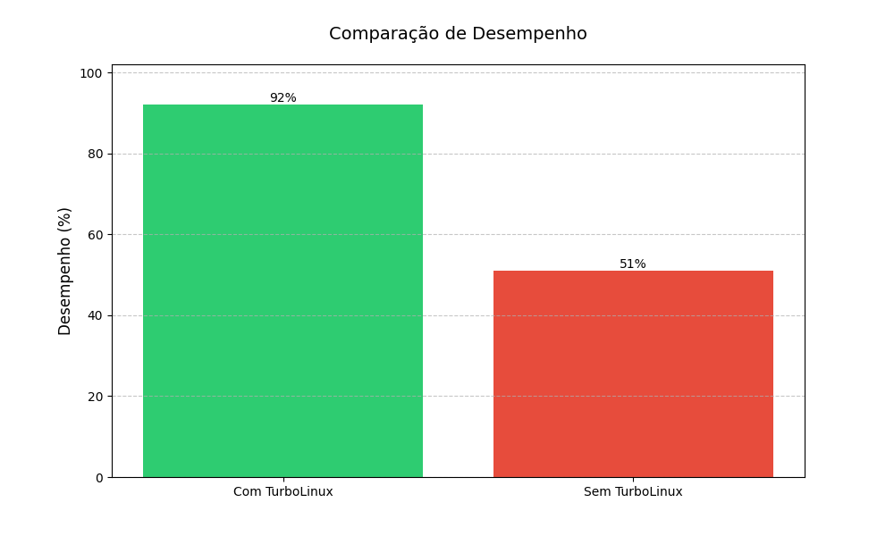

<h1 align="center">TurboLinux</h1>

<p align="center">
    
    
    
</p>

Este script otimiza o sistema **Linux** para melhorar a performance e reduzir o consumo de energia.
O script foi testado e é seguro para uso. Este script é de uso livre e pode ser distribuido **sem** problemas.

## Como usar

### Instalação e otimização

Para instalar e otimizar o sistema, basta seguir os seguintes passos:

1. Dê privilégios ao script:
```bash
chmod +x TurboLinux.sh
```

2. Agora rode o script:
```bash
./TurboLinux.sh
```

> **Nota**: Ao rodar, podem ser instalados pacotes adicionais, conforme necessário.

### Desinstalação
Para remover as otimizações e voltar às configurações padrão:
```bash
./TurboLinux.sh uninstall
```

## O que o script faz

### Modo de instalação
- Instala o preload para melhorar o tempo de carregamento dos aplicativos
- Otimiza as configurações da CPU para melhor performance
- Limpa o cache do sistema
- Atualiza os pacotes do sistema

### Modo de desinstalação
- Remove o preload
- Restaura as configurações da CPU para o modo padrão (ondemand)
- Remove otimizações aplicadas

## Desempenho

<p align="center">
    
</p>